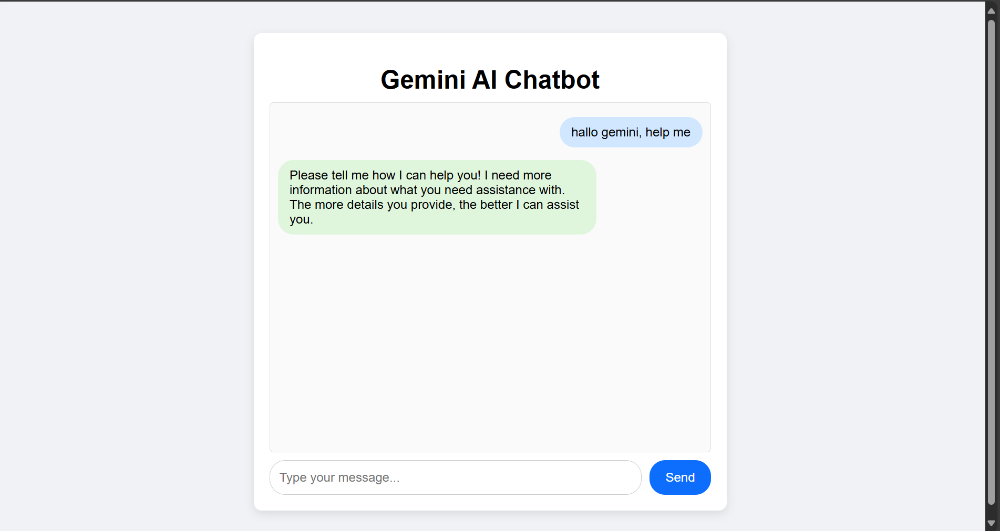

# 🤖 Gemini Chatbot (Node.js + Express)

**Gemini Chatbot** adalah aplikasi web sederhana berbasis Node.js + Express yang terintegrasi dengan API Gemini (Generative AI) dari Google. Aplikasi ini menerima input dari pengguna, mengirimkannya ke model AI, lalu menampilkan respons dalam bentuk web sederhana.




## 🚀 Teknologi yang Digunakan

- Node.js + Express
- Google Generative AI API (Gemini)
- Multer (untuk upload file)
- Dotenv (untuk mengelola API Key)
- HTML, CSS, JavaScript (client side)
- Middleware: CORS, JSON parser, URL-encoded parser

---

## 📁 Struktur Folder

| File/Folder        | Fungsi                                                                 |
|--------------------|------------------------------------------------------------------------|
| `index.js`         | Titik masuk utama aplikasi (Express server)                            |
| `.env`             | Menyimpan variabel lingkungan, seperti API Key                         |
| `public/`          | Folder berisi file statis (HTML, CSS, JS)                              |
| `uploads/`         | Folder penyimpanan sementara untuk file upload                         |
| `package.json`     | Konfigurasi npm dan daftar dependensi                                  |
| `script.js`        | Script client-side (berada di dalam folder `public`)                   |
| `style.css`        | Style halaman HTML                                                     |

---

## ⚙️ Persiapan Awal

1. **Clone repo** ini ke lokal:
   ```bash
   git clone https://github.com/namamu/gemini-chatbot.git
   cd gemini-chatbot
